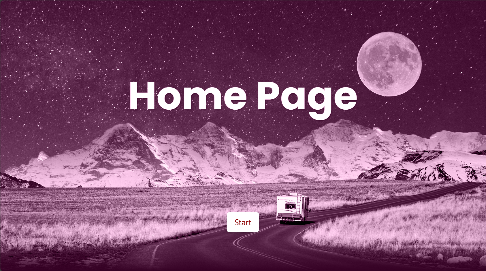
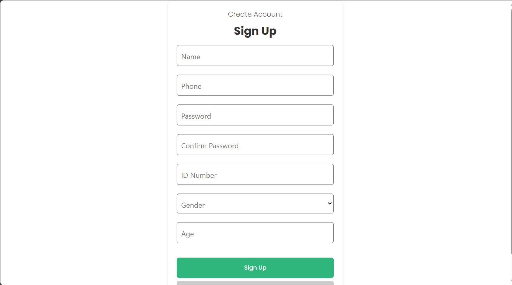
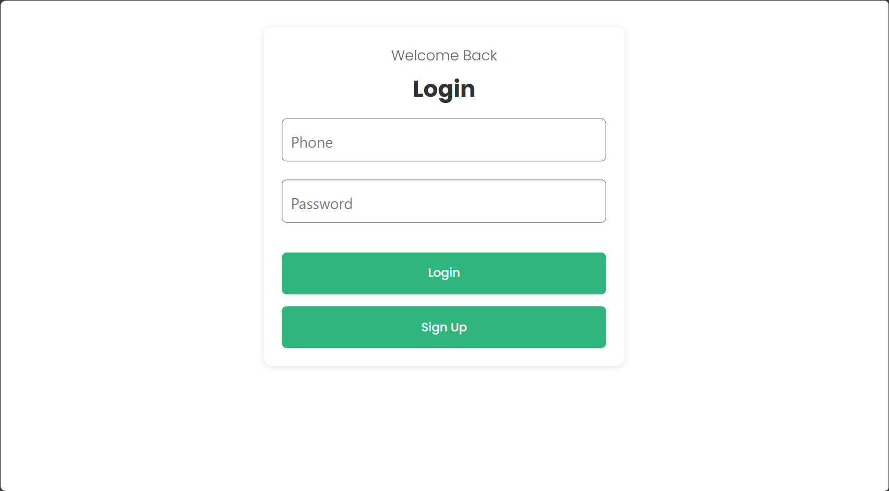
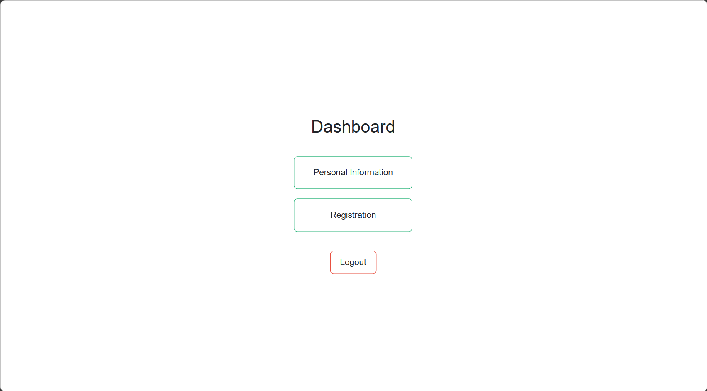
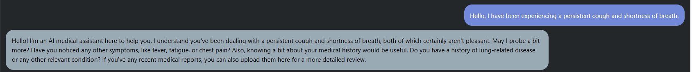
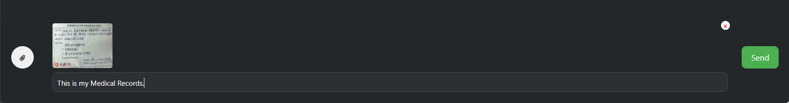
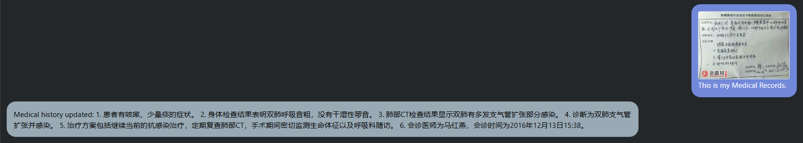
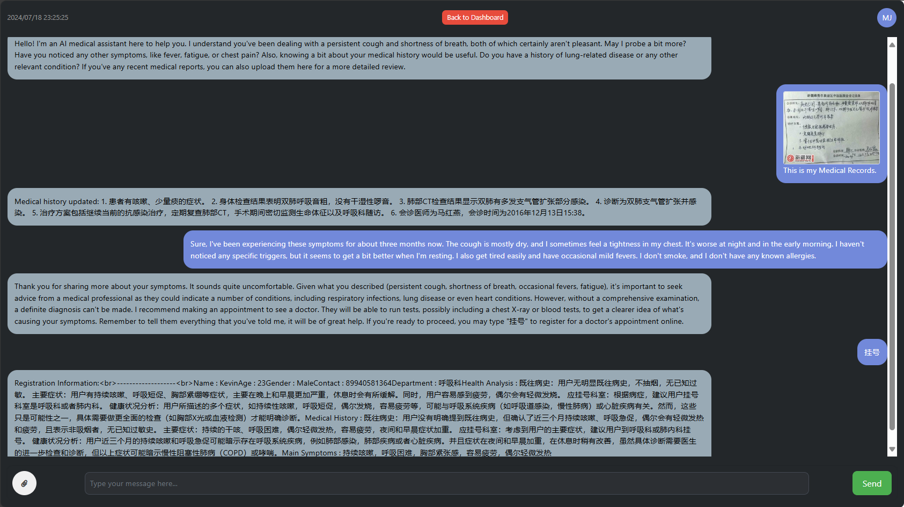

## 1. Architecture Overview

### 1.1 Introduction to the App

This application is developed by the SWS3004_11 group of students and aims to provide an efficient intelligent registration system. It is designed to streamline the pre-registration process for medical diagnosis by leveraging AI technologies. This system **INTERACTS** with patients to gather symptom descriptions and medical history, and generates a pre-registration document. The system also integrates OCR to extract information from medical records provided as images.

### 1.2 Project Background and Objectives

With the growing demand for efficient healthcare services, the need for an intelligent system that can assist in pre-registration and initial diagnosis has become crucial. The AI Smart Registration System aims to:

- Reduce the workload on medical staff by automating the pre-registration process.
- Improve patient experience by providing a seamless and interactive way to input their medical information.
- Ensure accurate and complete data collection for better diagnosis and treatment planning.

### 1.3 System Architecture

- **Front-end**: The front-end application is managed using SVC (Service) and the number of front-end pods is controlled using Horizontal Pod Auto-scaler (HPA).
- **Back-end**: The back-end service is also managed using SVC and the number of back-end pods is controlled using HPA. Technology stack includes Flask, OpenAI GPT-4 API, Azure Computer Vision API and a self-designed chat logic.
- **Database**: For stateful applications such as databases, a headless service is created to allow clients to directly access specific Pod instances. The Secret is used to pull images from a private repository, and StorageClass is defined for database storage requirements.

## 2. Environment Setup

### 2.1 System Requirements

- AWS Account: You need to have a valid AWS account.
- AWS EKS (Elastic Kubernetes Service) Cluster: You need to deploy an EKS cluster on AWS.

### 2.2 Dependencies

- AWS CLI (Command Line Interface): Used for managing AWS services.
- kubectl: Kubernetes command-line tool for interacting with the EKS cluster.
- eksctl: A tool for creating and managing EKS clusters.
- docker: For containerization of the application.

### 2.3 Configuration Steps

1. **Install AWS CLI**: Ensure that the AWS CLI is installed on your system and that your AWS credentials are configured.

2. **Install kubectl**: Ensure that kubectl is installed on your system.

3. Install eksctl

   : You can install eksctl using the following command:

   ```
   bashcurl --silent --location "https://github.com/weaveworks/eksctl/releases/latest/download/eksctl_$(uname -s)_amd64.tar.gz" | tar xz -C /tmp
   sudo mv /tmp/eksctl /usr/local/bin
   ```

4. Create EKS Cluster

   : Use eksctl to create an EKS cluster:

   ```
   bash
   eksctl create cluster --name my-cluster --region us-west-2
   ```

5. **Deploy Application using Docker Compose**: Place the `client` and `backend` folders in the same directory and run the following commands to build and deploy the application:

   ```
   docker compose up
   docker compose build
   ```


6. Kubernetes Features

   Our application leverages various Kubernetes features to ensure scalability, manageability, and efficient deployment:

   1. **Ingress Management**: Manages external access to services within the cluster, controlling routing rules efficiently.
   2. **Service Management**:
      - **Front-end and Back-end Services**: Both managed using Services (SVC) with Horizontal Pod Autoscaler (HPA) to automatically adjust the number of pod replicas based on resource utilization.
   3. **AI Model Integration**: A dedicated service for the AI model allows front-end applications to access AI interfaces, pulling data from hospitals and users.
   4. **ConfigMap and Secrets**: ConfigMap is used for configuration management, while Secrets securely store sensitive information like database credentials and API keys.
   5. **Persistent Volumes and StatefulSets**: 
      - **Database Storage**: Utilizes PV and PVC backed by NFS, with EC2 instances facilitating reliable database calls.
      - **StatefulSets**: Manage stateful applications ensuring stable, unique network identifiers and persistent storage.
   6. **Headless Service**: Allows direct client access to specific Pod instances, essential for stateful applications.
   7. **StorageClass**: Manages dynamic provisioning of Persistent Volumes, ensuring efficient allocation of storage resources.


## 3. Usage

1. **Start the Application**: 
    - Run the entire application. Once the application is running, open your web browser and navigate to the provided URL (e.g., `http://localhost`).
    
      
    
2. **User Registration and Login**:
   
    - If you are a new user, click on the "Sign Up" button and fill in the required details to create an account.
    
      

    - If you are an existing user, log in using your phone number and password.
    
      
    
3. **Navigate to Dashboard**:
   
    - After logging in, you will be directed to the dashboard where you can access your personal information and start the registration process.
    
    
4. **Interact with the Chatbot**:
    - On the registration page, you will see a chatbot interface. Begin by introducing yourself and describing your symptoms. You can type your responses in the chatbox and press 'Enter' to send.
    
    - Example conversation:
      - **User**: "Hello, I have been experiencing a persistent cough and shortness of breath."
      
      - **Chatbot**: "Hello! I'm an AI medical assistant here to help you..."
      
        
    
5. **Upload Medical Record Images**:
    - If you have any medical records in image format, you can upload them by clicking the 'Upload' button in the chat interface.
    
    - The system will use OCR technology to extract relevant information from the uploaded images.
      
    
      
    
6. **Processing and Pre-Registration Document Generation**:
   
    - The system will process your conversation and the extracted information from medical records to generate a pre-registration document.
    - You will receive a summary of your medical history, main symptoms, and the recommended department for consultation.
    

By following these steps, you can efficiently complete the pre-registration process, providing accurate and comprehensive information to the healthcare providers.